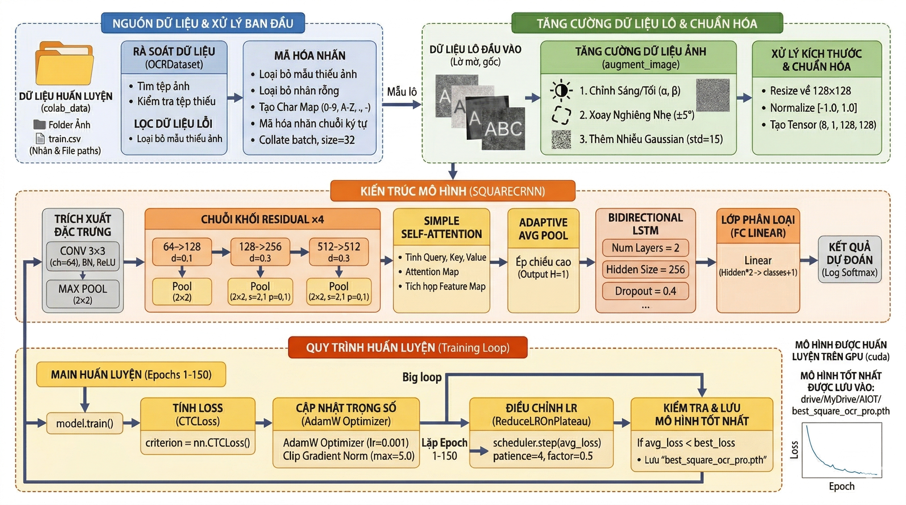

# 🔤 Square CRNN OCR: Pipeline Huấn Luyện Mô Hình Nhận Dạng Biển Số Xe

[](https://www.python.org/)
[](https://pytorch.org/)
[](https://opencv.org/)
[](https://docs.ultralytics.com/)
[](LICENSE)

Hệ thống nhận dạng ký tự quang học (OCR) độ chính xác cao dựa trên Học Sâu (Deep Learning), chuyên dụng cho biển số xe ký tự chữ và số (Việt Nam & Quốc tế). Mã nguồn cung cấp pipeline huấn luyện và đánh giá end-to-end kết hợp giữa mạng trích xuất đặc trưng hình ảnh ResNet, cơ chế chú ý không gian (Spatial Self-Attention), mạng học chuỗi thời gian BiLSTM (Bidirectional LSTM) và hàm mất mát CTC Loss.

---

## 🖼️ Sơ Đồ Pipeline Huấn Luyện (Training Pipeline)

Quy trình huấn luyện khép kín xử lý ảnh thô, tăng cường dữ liệu thông minh (Data Augmentation), huấn luyện mô hình và tự động lưu trọng số tối ưu:



---

## 🏛️ Kiến Trúc Mô Hình (`SquareCRNN`)

Kiến trúc mạng kết hợp hoàn hảo giữa Thị Giác Máy Tính (Computer Vision) và Xử Lý Chuỗi (Sequence Modeling):

```
Đầu Vào (Ảnh Xám 1 x 128 x 128 Grayscale Image)
  │
  ├── 🟢 Conv2d (1 -> 64, kernel=3, stride=1, padding=1) + BatchNorm + ReLU
  ├── 🔹 MaxPool2d (2x2, stride 2)
  │
  ├── 🟢 Khối Tàn Dư ResidualBlock 1 (64 -> 128, Dropout=0.1)
  ├── 🔹 MaxPool2d (2x2, stride 2)
  │
  ├── 🟢 Khối Tàn Dư ResidualBlock 2 (128 -> 256, Dropout=0.3)
  ├── 🔹 MaxPool2d (2x2, stride=(2,1), padding=(0,1))
  │
  ├── 🟢 Khối Tàn Dư ResidualBlock 3 (256 -> 512, Dropout=0.3)
  ├── 🔹 MaxPool2d (2x2, stride=(2,1), padding=(0,1))
  │
  ├── 🟢 Khối Tàn Dư ResidualBlock 4 (512 -> 512, Dropout=0.3)
  ├── 🌟 Lớp Chú Ý SimpleAttention (Trọng Số Hóa Đặc Trưng Không Gian)
  ├── 🔹 AdaptiveAvgPool2d (1 x W)
  │
  ├── 🔁 Mạng BiLSTM 2 Chiều 2 Lớp (Hidden Size: 256, Dropout=0.4)
  └── 🎯 Lớp Kết Nối Đầy Đủ CTC Output (Hidden*2 -> 37 Lớp Ký Tự)
```

---

## 📊 Định Dạng Dữ Liệu & Hướng Dẫn Tiền Xử Lý

### 1. Định Dạng Nhãn Dữ Liệu CSV (`train.csv`)
Nhãn dữ liệu huấn luyện được lưu trữ dưới dạng file CSV tiêu chuẩn gồm tên file ảnh và chuỗi ký tự tương ứng:

```csv
Tên bức ảnh,Nội dung bức ảnh
img_0.jpg,70C-159.51
img_1.jpg,59H-333.33
img_2.jpg,51F-645.85
img_3.jpg,43A-123.45
```

### 2. Bộ Ký Tự Hỗ Trợ (Vocabulary)
Tập ký tự mặc định bao gồm **38 token** (chữ số `0-9`, chữ cái in hoa `A-Z`, dấu gạch ngang `-`, dấu chấm `.`, và ký hiệu khoảng trống CTC blank tại chỉ số 0):

```python
CHARACTER_SET = "0123456789ABCDEFGHIJKLMNOPQRSTUVWXYZ-."
```

### 3. Tăng Cường Dữ Liệu Thông Minh (Smart On-the-Fly Data Augmentation)
Mô phỏng các điều kiện thực tế của camera (mờ, ánh sáng yếu, góc nghiêng), `OCRDataset` áp dụng:
- 💡 **Điều Chỉnh Độ Sáng & Độ Tương Phản**: $\alpha \in [0.7, 1.3]$, $\beta \in [-30, 30]$
- 📐 **Xoay Nghiêng Không Gian (Affine Rotation)**: Xoay ngẫu nhiên $\pm 5^\circ$ kết hợp bù viền ảnh
- 🌫️ **Nhiễu Ga-uss (Gaussian Noise)**: $\sigma = 15$ giúp mô hình hoạt động ổn định trong môi trường thiếu sáng

---

## 📁 Cấu Trúc Thư Mục Dự Án

```
train_ocr/
├── src/                          # Mã nguồn chính của dự án
│   ├── __init__.py               # Khai báo gói Python
│   ├── config.py                 # Cấu hình siêu tham số (Hyperparameters)
│   ├── model.py                  # Mô hình mạng nơ-ron PyTorch SquareCRNN
│   ├── train.py                  # Vòng lặp huấn luyện & Bộ nạp dữ liệu (Dataset Loader)
│   ├── data.py                   # Tiền xử lý, làm sạch & chuyển đổi dữ liệu
│   └── name_img.py               # Công cụ đổi tên ảnh hàng loạt
├── notebooks/                    # Thử nghiệm tương tác Jupyter
│   └── train.ipynb               # Notebook huấn luyện mô hình OCR
├── docs/                         # Tài liệu chi tiết
│   ├── API.md                    # Tài liệu tham chiếu hàm & module
│   ├── DATASET.md                # Quy chuẩn dữ liệu
│   ├── QUICKSTART.md             # Hướng dẫn nhanh
│   └── TROUBLESHOOTING.md        # Hướng dẫn xử lý lỗi
├── images/                       # Thư mục hình ảnh huấn luyện & ảnh mẫu
├── models/                       # Thư mục lưu trọng số (best_square_ocr_pro.pth)
├── tests/                        # Kiểm thử tích hợp hệ thống
│   └── test.py                   # Kiểm thử pipeline End-to-End YOLO + OCR
├── train.csv                     # File nhãn dữ liệu huấn luyện
├── training_pipeline.png         # Sơ đồ quy trình huấn luyện
├── requirements.txt              # Danh sách thư viện phụ thuộc
├── LICENSE                       # Giấy phép MIT
└── README.md                     # Tài liệu giới thiệu chính
```

---

## 🚀 Hướng Dẫn Cài Đặt, Huấn Luyện & Đánh Giá

### 1. Cài Đặt Môi Trường
```bash
# Tải mã nguồn từ GitHub
git clone https://github.com/phanhuynhvando/train_ocr.git
cd train_ocr

# Tạo và kích hoạt môi trường ảo Python
python3 -m venv venv
source venv/bin/activate

# Cập nhật pip và cài đặt thư viện phụ thuộc
pip install --upgrade pip
pip install -r requirements.txt
```

### 2. Huấn Luyện Mô Hình
Chạy file script để bắt đầu quá trình huấn luyện mô hình `SquareCRNN` với CTC Loss và bộ tự động điều chỉnh tốc độ học (Adaptive LR Scheduler):

```bash
python3 src/train.py
```

Chương trình sẽ tự động phát hiện card đồ họa NVIDIA CUDA để tăng tốc huấn luyện và tự động lưu trọng số tốt nhất vào `models/best_square_ocr_pro.pth`.

### 3. Bảng Siêu Tham Số Huấn Luyện (Training Hyperparameters)

| Tham Số | Giá Trị Mặc Định | Mô Tả Kỹ Thuật |
| :--- | :--- | :--- |
| **Kích Thước Đầu Vào** | `128 x 128` | Kích thước ảnh xám đầu vào chuẩn hóa |
| **Kích Thước Batch** | `32` | Số mẫu trên mỗi lượt huấn luyện (Batch Size) |
| **Tốc Độ Học (Learning Rate)** | `0.001` | Tốc độ học ban đầu cho thuật toán AdamW |
| **Bộ Điều Chỉnh Tốc Độ Học** | `ReduceLROnPlateau` | Patience: 4 epoch, Factor: 0.5 |
| **Suy Giảm Trọng Số** | `1e-4` | L2 Regularization (Weight Decay) |
| **Cắt Cụm Đạo Hàm (Gradient Clip)** | `5.0` | Giới hạn Max Norm tránh bùng nổ gradient |
| **Hàm Mất Mát (Loss Function)** | `CTCLoss` | Connectionist Temporal Classification |

### 4. Đánh Giá & Suy Luận End-to-End (YOLO Detection + OCR)
Chạy thử nghiệm toàn bộ pipeline nhận dạng biển số xe từ phát hiện vị trí đến đọc ký tự:

```bash
python3 tests/test.py
```

```python
# Đoạn mã ví dụ suy luận trực tiếp với PyTorch:
import cv2
import torch
from src.model import SquareCRNN

# Cấu hình thiết bị phần cứng
device = torch.device('cuda' if torch.cuda.is_available() else 'cpu')
model = SquareCRNN(num_classes=38).to(device)
model.load_state_dict(torch.load("models/best_square_ocr_pro.pth", map_location=device))
model.eval()

# Tiền xử lý ảnh đầu vào
img = cv2.imread("images/img_0.jpg", cv2.IMREAD_GRAYSCALE)
img = cv2.resize(img, (128, 128))
tensor = torch.from_numpy((img.astype('float32') / 127.5) - 1.0).unsqueeze(0).unsqueeze(0).to(device)

# Thực hiện suy luận mô hình
with torch.no_grad():
    preds = model(tensor)
```

---

## 📜 Giấy Phép

Dự án được phân phối dưới giấy phép **MIT License** - xem file [LICENSE](LICENSE) để biết thêm thông tin chi tiết.

---

## 👨‍💻 Tác Giả

**Phan Huỳnh Văn Đô**  
GitHub: [@phanhuynhvando](https://github.com/phanhuynhvando)
